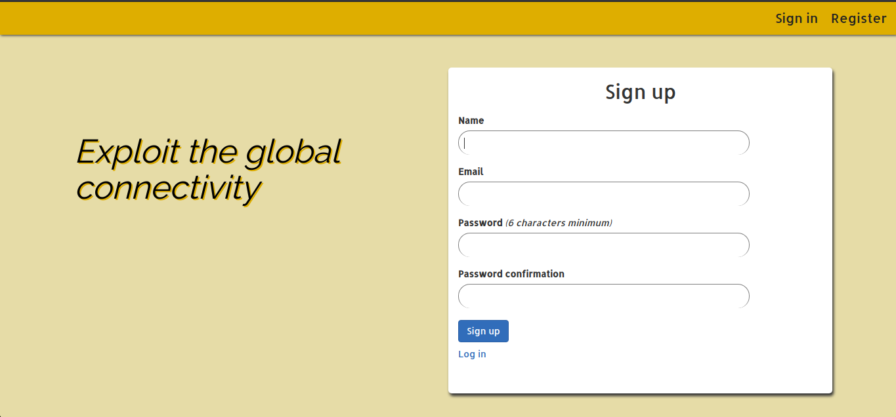
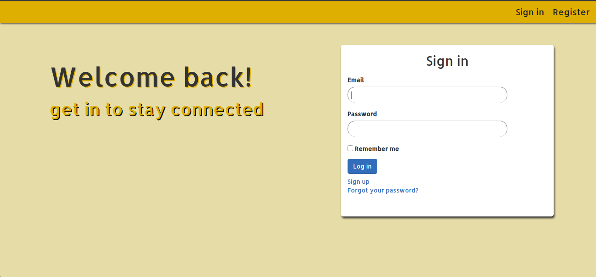

# 🔐 Blog app: add API endpoints

> In this project I create API endpoints that allow users to interact with Social app. The users must be authenticated first.

***********

## 💻 Previews
Signup Page
  

Login Page
  


## 🛠️ Built With

  - Ruby: 2.5.0
  - Rails: 5.2.4
  - Postgres: >=12.11

## 🛠️ How to run the App

- Prerequisites

  - Ruby: 2.5.0
  - Rails: 5.2.4
  - Postgres: >=12.11


## 🛠️ Getting Started

To get a local copy up and running follow these simple example steps.

1. Open Terminal.
2. Navigate to your desired location to download the contents of this repository.
3. Clone this repository: 
```
  git clone https://github.com/Qoosim/blog-api.git
```
4. Run 
```
  cd blog-api
```

## 🛠️ Setup

- Instal necessary gems with:

```
  bundle install
```

- Setup database with:

```
   rails db:create
   rails db:migrate
```

## 🕹️ Usage

- Navigate to the root directory of the project
- Run 
```
  rails server
```
- Open a browser and visit 
```
 `http://localhost:3000/` or 127.0.0.1:3000
```
- Sign in or sign up to create events!

## 🧪 Testing

- Run
```
  rspec -f -d
```

## 🎉 Features

### API endpoint to list all posts for a user
  - http://localhost:3000/api/users/user_id/posts

### API endpoint to list all comments for a post
  - http://localhost:3000/api/users/user_id/posts/post_id/comments

### API endpoint to add a comment to a post
  - http://localhost:3000/api/users/user_id/posts/post_id/comments


## 🧪 Testing
```
    rpsec
```

## 🕹️ Contributions, Issues & Forking

If you have any issues setting up the project or you come across any unintended bugs or problems, please do submit an issue to the [Blog-API](https://github.com/Qoosim/blog-api/issues) page.

If you want to make your own changes, modifications or improvements to this project, go ahead and Fork it!
1. [Fork it](https://github.com/Qoosim/blog-api/fork)
2. Create your working branch (git checkout -b [choose-a-name])
3. Commit your changes (git commit -am 'what this commit will fix/add/improve')
4. Push to the branch (git push origin [chosen-name])
5. Create a new Pull Request

## 👨🏽‍💻 Author
**Qoosim AbdulGhaniyy**

- Github: [@Qoosim](https://github.com/Qoosim)
- Twitter: [@qoosim_ayinde](https://twitter.com/qoosim_ayinde)
- Linkedin: [qoosim_abdulghaniyy](https://www.linkedin.com/in/qoosim-abdulghaniyy)

## 🧴 Show Your Support

Give a ⭐️ if you like this project!
